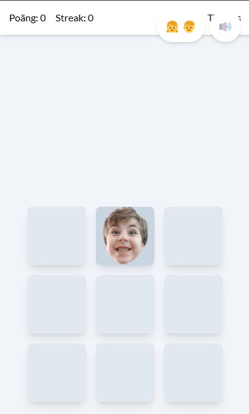

# Whack-A-Lindestrand

A "Whack-A-Mole" game built with React, TypeScript, and Vite, where the goal is to hit images of Alicia and Alexander as quickly as possible.

## Screenshot



## Features

*   **Game Mechanics:** Hit the moles (Alicia/Alexander) that randomly appear in a 3x3 grid.
*   **Scoring System:** Earn points for each hit. The difficulty level affects the points per hit.
*   **Streak:** Build up a streak by hitting multiple moles in a row for bonus points (currently implemented for tracking, bonus points are a future feature).
*   **Time Limit:** The game has a time limit (default 30 seconds).
*   **Power-ups:** Randomly collect power-ups during the game:
    *   ✨ Double Points
    *   ⏰ Slow Motion (moles move slower)
    *   ⌛ Extra Time (+5 seconds)
*   **Difficulty Levels:** Choose between Easy, Normal, and Hard, affecting mole speed and points.
*   **Character Selection:** Play with only Alicia, only Alexander, or a mix of both.
*   **High Scores:** The game saves the top 10 scores locally in the browser.
*   **Game Statistics:** Tracks total games played, total score, best score, and longest streak locally.
*   **Sound & Vibration:** Sound effects for hits, power-ups, start, and game over. Vibration on hit (if the device supports it).
*   **Animations:** Uses Framer Motion for smooth animations and `canvas-confetti` for confetti on hits.
*   **Responsive Design:** Adapts to different screen sizes.

## Technologies Used

*   **Frontend:** React, TypeScript
*   **Build Tool:** Vite
*   **Styling:** Tailwind CSS
*   **Animations:** Framer Motion, Canvas Confetti
*   **Linting/Formatting:** ESLint

## How to Run the Project

1.  **Clone the repository (if you haven't already):**
    ```bash
    git clone <repo-url>
    cd WhackALindestrand
    ```
2.  **Install dependencies:**
    ```bash
    npm install
    # or yarn install / pnpm install
    ```
3.  **Start the development server:**
    ```bash
    npm run dev
    # or yarn dev / pnpm dev
    ```
4.  Open your browser and navigate to the local address provided in the terminal (usually `http://localhost:5173`).

## Available Scripts

*   `npm run dev`: Starts the development server with Hot Module Replacement (HMR).
*   `npm run build`: Builds the application for production to the `dist` folder.
*   `npm run lint`: Runs ESLint to find and fix issues in the code.
*   `npm run preview`: Starts a local server to preview the production build.
